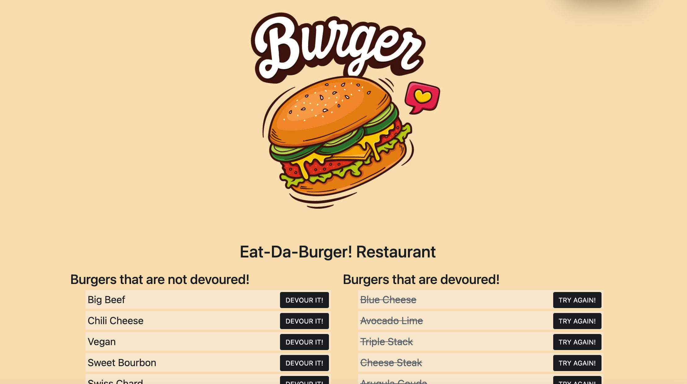

# Eat-Da-Burger! 🍔 Restaurant App

## Description
Eat-Da-Burger! is a restaurant app that lets users input the names of burgers they'd like to eat.

## Table of Contents
* [Installation](#installation)
* [Usage](#usage)
* [Resources](#resources)
* [Credits](#credits)
* [License](#license)
* [Contributing](#contributing)
* [Questions](#questions)

## Installation
### Steps required to run locally
1. Clone/download the code in this repo
2. Navigate to the location of the code downloaded
3. Double-click on the html file provided in the downloaded code to preview 
### Steps required to online
Click this link to [VIEW APP](https://mini-octo-burgers.herokuapp.com/ )

## Usage 
This code should be used for the purpose of creating/editing code for a Eat-Da-Burger! app. 

## Credits
1 contributor: @stopdaydreaming  
Special thanks to my amazing tutor!

## License
Copyright (c) Eat-Da-Burger!. All rights reserved.
Licensed under the [MIT](LICENSE) license.

## Features
None at this time

## Contributing
None at this time

## Tests
None at this time  

## Badges
